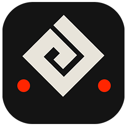

  

# Black Desert Market

Black Desert Market is a web recreation of Central Market from the game Black Desert Online. Project has a market API and UI resembling in-game market interface.

## Motivation
Motivation behind this project is that the official web market is very lackluster in terms of functionality when compared to the in-game one. There simply was not a single good solution that had the same experience as the market we know from game - thus the project was made.

## Implementation
This project uses data from official web market API ([https://eu-trade.naeu.playblackdesert.com/Home](https://eu-trade.naeu.playblackdesert.com/Home)), but is adjusted to be more usable in real world applications.

## API Documentation
Documentation for the API can be found here: [https://api.blackdesertmarket.com](https://api.blackdesertmarket.com).

## Legal Considerations
Legal Considerations for the whole project can be found here: [https://blackdesertmarket.com/legal](https://blackdesertmarket.com/legal).

## Contributing
Contribution in any form is welcome, feel free to submit a pull request with any change that you think would make this project better. We will appreciate help in any possible way.
